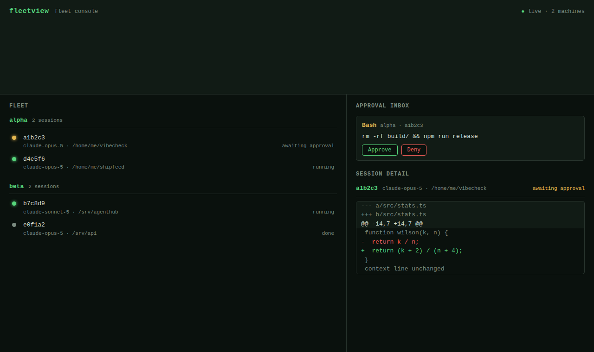

# fleetview

**A control plane for your Claude Code agents — across every machine, in one pane.**

fleetview shows live Claude Code sessions running on *multiple machines* in a
single web dashboard, gives you one **remote-approval inbox** for the permission
prompts those agents raise, and renders the **evidence** (a unified diff) inline
next to the session that produced it.



## Why this, when there are already agent dashboards

The good tools are **local-single-box**: [vibe-kanban](https://github.com/BloopAI/vibe-kanban),
octomux, claude-squad all run parallel agents as worktrees on *one* laptop.
Anthropic's own [Remote Control](https://code.claude.com/docs/en/remote-control)
lets you approve prompts from your phone — but for *one* machine, one user.

Nobody puts the four things together that you actually need to run agents
seriously:

| | multi-machine | remote approval | inline evidence | open source |
|---|---|---|---|---|
| vibe-kanban / octomux | ✗ (local) | partial | ✓ | ✓ |
| Anthropic Remote Control | ✗ (1 machine) | ✓ | ✗ | ✗ |
| **fleetview** | **✓** | **✓** | **✓** | **✓** |

## Architecture

Two processes, one WebSocket protocol:

```
  machine A          machine B                 your browser
 ┌──────────┐       ┌──────────┐              ┌───────────────┐
 │fleet-node│       │fleet-node│              │ dashboard     │
 └────┬─────┘       └────┬─────┘              └───────┬───────┘
      │  sessions/prompts/artifacts (WS)              │ snapshot/patch (WS)
      └──────────────┬───────────────┬───────────────┘
                     ▼               ▼
                 ┌───────────────────────┐
                 │     fleet-server      │  aggregates all nodes,
                 │  (in-memory + web UI) │  serves the dashboard,
                 └───────────────────────┘  routes approvals back
```

A **fleet-node** runs on each machine, reads its local Claude Code sessions, and
pushes them to a central **fleet-server** that aggregates every node's state and
serves the dashboard. Approvals travel back server → node → the agent.

## Quickstart (a fleet of two, in three commands)

```bash
npm install && npm run build

# 1. the server (localhost by default — see Security)
FLEETVIEW_TOKEN=secret node dist/server/main.js

# 2. a node on this machine, and 3. one on another (or a second terminal)
FLEETVIEW_TOKEN=secret node dist/node/main.js --machine alpha --source simulated
FLEETVIEW_TOKEN=secret FLEETVIEW_SERVER=ws://SERVER_HOST:4300 \
  node dist/node/main.js --machine beta --source real
```

Open `http://localhost:4300`. Both machines' sessions appear, grouped by machine
and updating live. When a session raises a permission prompt it lands in the
**Approval inbox** — Approve or Deny, and the decision reaches the agent.

### The 30-second demo

```bash
npm run build && FLEETVIEW_TOKEN=demo node scripts/e2e.mjs
```

Spawns the server + two simulated nodes, connects as a browser, and asserts the
whole path — multi-machine list, a prompt in the inbox, Approve → the session
unblocks and a diff artifact renders. It prints each step as it verifies it.

## Session sources

`--source` selects where a node gets its sessions:

- **`simulated`** — a deterministic scripted lifecycle (start → run → raise a
  permission prompt → on approve, emit a diff and finish). Drives the demo and
  the entire offline test suite; two simulated nodes = a two-machine fleet.
- **`real`** — a best-effort, **read-only** reader of your local Claude Code
  transcripts under `~/.claude/projects/…`, exposing session id, cwd, model, and
  a heuristic running/done status. If the layout is missing or odd, it degrades
  to "no sessions" rather than crashing. A fleet console shows the *live* fleet,
  so it surfaces only sessions touched in the last day, newest first, capped to
  50 — not the entire months-deep transcript archive.

## Deploy: a public dashboard over Cloudflare Tunnel

The server is a plain Node process, so any reverse proxy / tunnel puts it on the
public internet with no code change. With [`cloudflared`](https://developers.cloudflare.com/cloudflare-one/connections/connect-networks/):

```bash
FLEETVIEW_TOKEN=secret node dist/server/main.js         # localhost:4300
cloudflared tunnel --url http://127.0.0.1:4300          # → https://<name>.trycloudflare.com
FLEETVIEW_TOKEN=secret node dist/node/main.js --machine this-box --source real
```

Open the printed `https://…trycloudflare.com` URL from anywhere — the browser
loads the dashboard and its WebSocket rides the same tunnel. The same-origin
guard passes because the tunnel preserves the `Host` header (browser `Origin` ==
`Host`); node clients send no `Origin` and are gated by the token. For a stable
hostname that survives restarts, use a **named** tunnel + a service manager
instead of the quick tunnel above.

## Security

- **Shared bearer token.** Every node connection must present `FLEETVIEW_TOKEN`;
  the server **refuses to start without one** (fail-closed) and compares tokens
  in constant time.
- **Same-origin only.** Browser WebSocket connections are rejected unless their
  `Origin` matches the server — this blocks cross-site WebSocket hijacking (a
  malicious page can't open your dashboard's socket and approve prompts).
- **Localhost by default.** The server binds `127.0.0.1`. A real multi-machine
  fleet sets `HOST=0.0.0.0` explicitly — do that **behind a firewall/VPN**; the
  token is a credential, not a substitute for network controls.
- **In-memory only.** No database; a restart drops history and nodes re-announce.

## Roadmap — what v1 does *not* do yet

- **Gate real Claude Code agents.** In v1, Approve/Deny controls the *simulated*
  source end-to-end; wiring the decision into a live agent's permission prompt
  (via [agentkit](https://github.com/duthaho/agentkit)'s `canUseTool` engine) is
  the named next step.
- Persistence/history, per-node identities (v1 is one shared token), cost
  metering, and artifact types beyond unified diffs.

## Development

```bash
npm test        # offline: real in-process WebSockets, simulated source, fixture ~/.claude
npm run build   # tsc (server/node) + tsc (browser-ESM client), no bundler
```

MIT.
